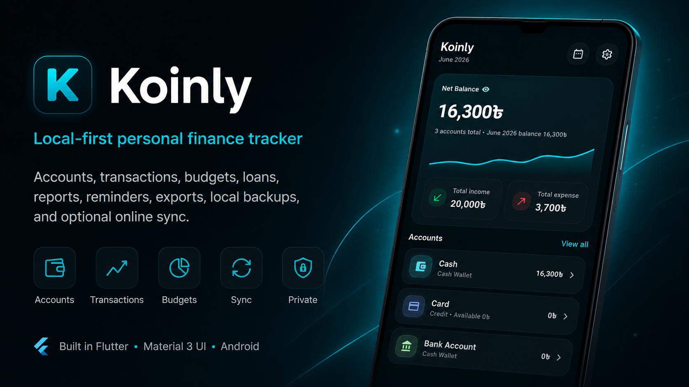
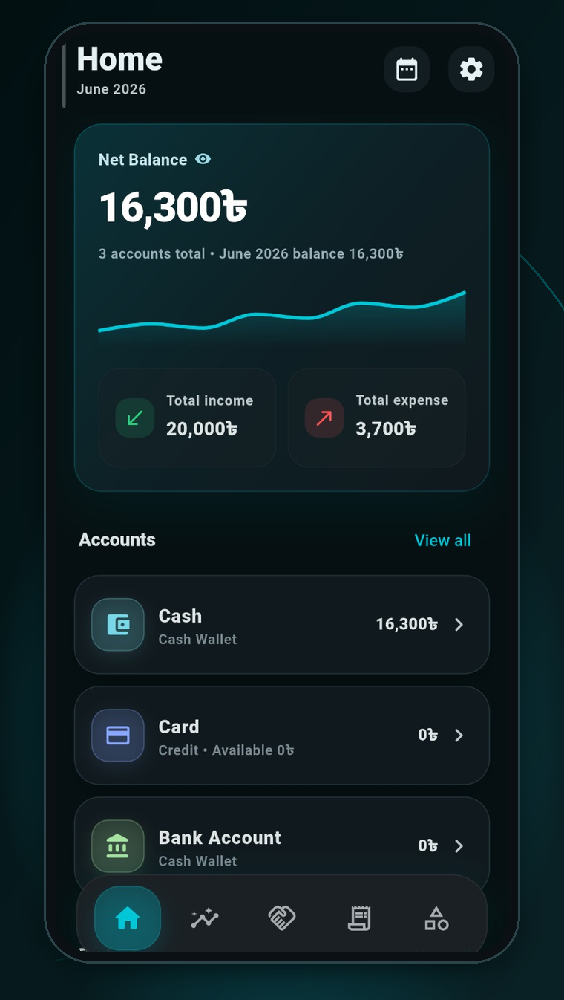
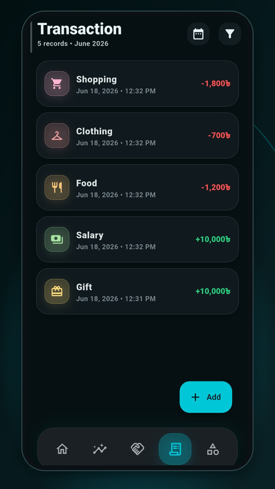
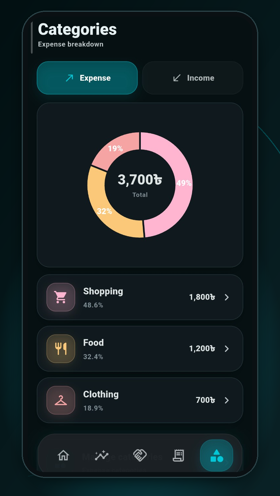
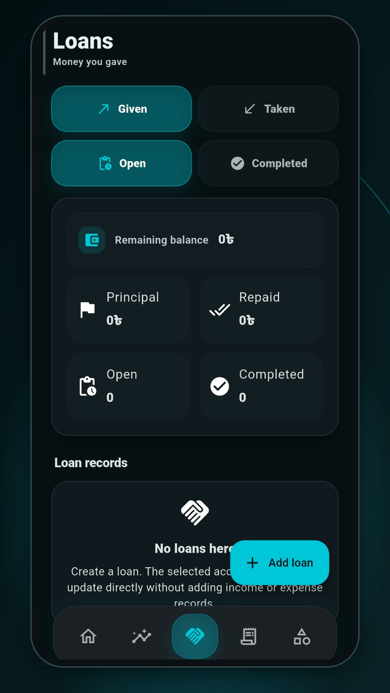
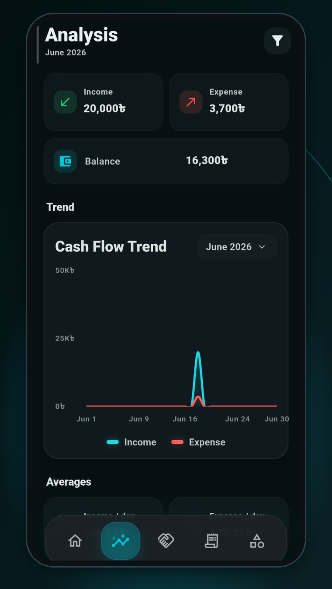

# Koinly Flutter

A local-first personal finance tracker built in Flutter with a polished Material 3 mobile and desktop UI. Koinly helps users manage accounts, transactions, categories, budgets, loans, savings, reminders, reports, exports, local backups, and optional online sync from one Android or Windows app.



---

## Current app version

- App version: `1.0.67+68`
- Android `versionName`: `1.0.67`
- Android `versionCode`: `68`
- Windows installer output: `KoinlySetup.exe`
- Every project update must bump `pubspec.yaml`, `android/app/build.gradle`, and `lib/main.dart`.

---

## Project status

| Area | Current implementation |
| --- | --- |
| App framework | Flutter / Dart |
| Platforms | Android and Windows |
| UI system | Material 3 Expressive-style cards, motion, centered popups, adaptive spacing |
| Local database | SQLite via `sqflite` and desktop SQLite FFI |
| State management | `provider` + `ChangeNotifier` |
| Analytics/crash reporting | Firebase Analytics + Crashlytics with optional initialization |
| Online sync | Optional cloud/database sync |
| Visible sync database | MongoDB Database |
| Hidden/internal providers | Local, Turso, Cloudflare D1, Supabase, Neon, Firebase Firestore placeholders |
| Admin approval | Admin approval flow with Telegram contact |
| Backup/restore | Local `.koinlybackup` files |
| CI build | GitHub Actions for Android APKs and Windows installer |
| Android outputs | Universal, ARM32, ARM64 release APKs |
| Windows output | `KoinlySetup.exe` |
| License | Apache License 2.0 |

---

## README sync note

This README was rebuilt by comparing the current Koinly version with the uploaded `Koinly-main.zip`.

Kept from the uploaded version where still accurate:
- clean project status section
- feature grouping
- backend setup references
- build instructions
- troubleshooting structure
- API/backend documentation style

Added for the current app:
- Windows installer workflow and `KoinlySetup.exe`
- Material 3 Expressive UI behavior
- Hidden Settings naming
- single-toggle category and loan filters
- MongoDB-only visible sync configuration
- current Sync and Download Data behavior
- Financial Health Summary popup behavior
- daily 10 Savings Account suggestion bubbles
- loan repayment reminders and budget alert summary behavior

Corrected from the older README:
- Android-only wording was replaced with Android and Windows wording.
- Old compact home summary wording was not kept as a current feature.
- Old download-cloud wording was replaced with current Download Data behavior.
- Outdated sync provider wording was replaced with the current MongoDB-visible flow.

---

## Latest changes

### Version 1.0.67+68

- refreshed README against uploaded `Koinly-main.zip`
- documented the current Android and Windows workflow
- documented Financial Health Summary period-end popup behavior
- documented daily 10 Savings Account suggestions
- documented current sync behavior
- preserved app icon, signing support, GitHub Actions, and installer workflow

### Version 1.0.66+67

- Savings Accounts page now uses 10 daily suggestions.
- Suggestion bubbles show as mystery `?` bubbles before tapping.
- Checked suggestions are saved for the day.
- After all 10 are checked, suggestions stop until the next day.

### Version 1.0.65+66

- fixed nullable date handling in Analysis chart data.
- all-time ranges and empty transaction history now use safe chart ranges.

### Version 1.0.64+65

- removed Financial Health Summary from the Analysis page.
- moved monthly and yearly summaries into end-of-period popup flows.
- users can review pages or skip all.
- skipped/reviewed summaries are remembered.

### Version 1.0.62+63 to 1.0.63+64

- added monthly/yearly Financial Health Summary calculations.
- included income, expense, savings, loans, bills, reminders, and budgets.
- added yearly month-by-month breakdown and comparison logic.
- fixed a Dart `num` to `double` chart build failure.

### Version 1.0.60+61 to 1.0.61+62

- removed the extra Savings Accounts tune/filter button.
- changed savings suggestions so they appear randomly instead of always showing.
- changed Categories Expense/Income into one toggle button.
- changed Loans Given/Taken into one toggle button.
- changed Loans Open/Completed into one toggle button.

---

## Core data rules

Koinly is strict about money classification.

- Income counts only as income.
- Expense counts only as expense.
- Regular transfers are internal.
- Savings transfers are internal and never count as income or expense.
- Given Loans reduce the selected paying account.
- Taken Loans increase the selected receiving account.
- Loan principal movement does not inflate income/expense.
- Loan repayments update loan balance and account balance.
- Bills and subscriptions are tracked separately for reminders and summaries.
- Budget usage comes from real expense category spending.
- Exports follow active filters.

---

## Features

### Accounts

Koinly supports regular accounts, credit accounts, and Savings accounts. Users can create, edit, delete, reorder, color, and icon-tag accounts. Account balances appear across Home and account pages. Savings balances are kept separate from normal operating balances.

### Transactions

Koinly supports income, expense, and transfer transactions with date/time, amount, account, category, and notes. Filters support date range, account, category, and transaction type. Transfer records avoid category double counting. Savings movements stay out of income/expense totals.

### Categories

Income and expense categories are managed from one page. Expense/Income uses one toggle button. Category cards use icons and colors. Category detail pages show real category transactions only. Transfer and Savings transfer rows are excluded from category spending pages.

### Budgets

Budgets support monthly limits, category scope, account scope, progress tracking, remaining budget, and alert levels. Status can be safe, warning, near limit, limit reached, or overspent. Budget data is included in Financial Health Summary.

### Loans

Loans support Given Loans and Taken Loans. Given/Taken uses one toggle button. Open/Completed uses one toggle button. Given Loan means money goes out; Taken Loan means money comes in. Partial repayments, repayment history, overdue highlighting, and loan repayment reminders are supported. Loan activity is included in Financial Health Summary but excluded from normal income/expense totals.

### Savings

Savings has a dedicated Savings Accounts page. Transfers into and out of Savings are internal transfers. Savings activity appears separately in summaries. Savings suggestion profile is available in Settings. The Savings page shows 10 daily mystery `?` suggestion bubbles. Tapping a bubble opens the full suggestion. Checked suggestions are saved for the day. After all 10 are checked, no more appear until the next day.

### Financial Health Summary

Financial Health Summary is not a fixed Analysis page section. It appears automatically after a month or year ends. Users can go through summary pages or skip all. Skipped and reviewed summaries are remembered.

The summary includes income, expenses, net flow, savings transfers, savings balance movement, current savings balance, loans given/taken, repayments paid/received, recurring bills/subscriptions, paid/unpaid/upcoming/overdue bills, loan repayment reminder status, partial repayments, overdue alerts, budget usage, remaining budget, overspent categories, and a health result.

Possible status results include Saved Money, Overspent, Increased Debt, Reduced Debt, Stable Month, Stable Year, and Strong Savings Growth.

Yearly view includes month-by-month income, expense, savings, loans, repayments, bills, budget usage, best month, worst month, highest income month, highest expense month, highest savings month, and most overspent month.

### Reminders

Reminder-related data supports bills, subscriptions, tuition, rent, internet bills, mobile recharge, electricity bills, EMI payments, scheduled payments, loan repayments, partial repayments, and overdue alerts. Reminder status is included in Financial Health Summary.

### Analysis and reports

The Analysis page remains focused on charts and analytics: income/expense charting, cash flow trend, category breakdown, budget usage context, filter-aware summaries, responsive chart cards, and Material 3 Expressive-style spacing. Financial Health Summary appears as a period-end popup, not as a permanent Analysis card.

### Exports

Koinly supports CSV export, PDF export, filter-aware export data, shared export files, and summaries based on active filters.

### Settings

Settings includes theme, currency, currency symbol/code, prefix/suffix placement, number separators, daily reminder time, default account, default expense category, default income category, default date filter, Savings suggestion profile, backup/restore, app lock/security, About, privacy policy, terms, and licenses.

### Hidden Settings

Hidden Settings keeps secondary controls away from the main workflow. Examples include defaults, reorder tools, backup tools, lock/security options, and online sync advanced options.

---

## Online data sync

Online sync is optional. The app remains local-first.

### Visible database provider

Only this provider is visible to normal users:

```text
MongoDB Database
```

### MongoDB configuration

The visible MongoDB provider asks for:

```text
MongoDB URL
```

Extra database and collection fields are hidden from regular users.

### Hidden/internal providers

The code keeps placeholders for Local Database, Turso Database, Cloudflare D1, Supabase Postgres, Neon Postgres, and Firebase Firestore. These are not part of the normal visible workflow right now.

### Current sync buttons

| Button | Behavior |
| --- | --- |
| Sync | Uploads local data to the configured database/cloud target |
| Download Data | Downloads/restores cloud data to this device |
| Download cloud data to this device | Removed |

### Automatic sync

Automatic sync is enabled when a database is configured. The app silently retries when internet returns. Admin approval is respected. Sync errors are shown through app status messages where needed.

### Admin approval

New Sync IDs require admin approval. If approval is missing, the app shows an activation/admin message and a Telegram contact button. Approved users can sync. Rejected or blocked users cannot sync.

```text
https://t.me/Ch0wdhury_Siam
```

### Sync backend URL

The Worker URL is injected at build time:

```bash
--dart-define=KOINLY_SYNC_API_BASE_URL=https://your-worker-url.workers.dev
```

GitHub Actions can read it from the manual workflow input `sync_api_base_url`, repository variable `KOINLY_SYNC_API_BASE_URL`, or repository secret `KOINLY_SYNC_API_BASE_URL`.

If empty, the app still builds, but online sync shows a backend URL configuration error until rebuilt with the Worker URL.

---

## Backup and restore

Backup files use `.koinlybackup`. Backup includes local app data and preferences. Restore replaces local data with backup contents. Backup/restore works separately from online sync. Local-only use does not require a sync account.

---

## Screenshots

Screenshot files are stored in:

```text
assets/images/readme/
```

Expected screenshots:

```text
assets/images/readme/home.png
assets/images/readme/transactions.png
assets/images/readme/categories.png
assets/images/readme/loans.png
assets/images/readme/analysis.png
```

| Home | Transactions |
| --- | --- |
|  |  |

| Categories | Loans |
| --- | --- |
|  |  |

| Analysis |
| --- |
|  |

---

## Tech stack

| Layer | Technology |
| --- | --- |
| UI | Flutter |
| Language | Dart |
| State | Provider |
| Local database | SQLite |
| Android database | `sqflite` |
| Desktop database | `sqflite_common_ffi` |
| Charts | `fl_chart` |
| PDF export | `pdf` + `printing` |
| File picker | `file_picker` |
| Sharing | `share_plus` |
| Secure storage | `flutter_secure_storage` |
| Biometrics/device auth | `local_auth` |
| Notifications | `flutter_local_notifications` |
| Time zones | `timezone` |
| Firebase | Analytics + Crashlytics |
| HTTP | `http` |
| MongoDB | `mongo_dart` |
| IDs | `uuid` |

---

## Project structure

```text
.
├── .github/
│   └── workflows/
│       └── build-android-apks.yml
├── android/
│   └── app/
├── assets/
│   ├── icons/
│   └── images/
├── backend/
│   └── cloudflare-turso/
├── lib/
│   └── main.dart
├── tools/
│   └── windows/
├── pubspec.yaml
├── analysis_options.yaml
├── README.md
└── LICENSE
```

The app is currently implemented mainly in `lib/main.dart`. GitHub Actions can regenerate platform files where needed. The Windows workflow generates Windows platform files before packaging. The installer artifact remains `KoinlySetup.exe`.

---

## Data model overview

The app stores local data for accounts, categories, transactions, budgets, loans, repayments, loan repayment reminders, savings suggestion profile, daily savings suggestion seen status, settings/preferences, sync configuration, and backup metadata.

Important classification fields include transaction type, account IDs, category ID, loan metadata, transfer target, created date/time, reminder status, and budget scope.

---

## Requirements

Android:
- Flutter stable
- Java 17
- Android SDK/build tools
- NDK configured by workflow
- Gradle wrapper restored/configured by workflow

Windows:
- Flutter stable
- Windows desktop support
- Visual Studio Build Tools with Desktop C++ workload
- Inno Setup in CI
- optional code signing certificate

---

## Local setup

Install dependencies:

```bash
flutter pub get
```

Run Android:

```bash
flutter run
```

Run Windows:

```bash
flutter config --enable-windows-desktop
flutter run -d windows
```

Build universal APK:

```bash
flutter build apk --release \
  --dart-define=KOINLY_SYNC_API_BASE_URL=https://your-worker-url.workers.dev
```

Build ARM32/ARM64 APKs:

```bash
flutter build apk --release --split-per-abi \
  --dart-define=KOINLY_SYNC_API_BASE_URL=https://your-worker-url.workers.dev
```

Build Windows release:

```bash
flutter build windows --release \
  --dart-define=KOINLY_SYNC_API_BASE_URL=https://your-worker-url.workers.dev
```

---

## GitHub Actions build

Workflow:

```text
.github/workflows/build-android-apks.yml
```

The workflow builds:

```text
artifacts/koinly-universal-release.apk
artifacts/koinly-armeabi-v7a-release.apk
artifacts/koinly-arm64-v8a-release.apk
artifacts/KoinlySetup.exe
```

Workflow behavior:
- supports manual dispatch
- supports push to `main` or `master`
- accepts optional Worker URL input
- preserves Android signing support
- preserves Windows signing support
- generates Windows installer
- patches Windows CMake compatibility where needed

The installer filename must stay:

```text
KoinlySetup.exe
```

---

## Release signing

Android release signing support is preserved.

Typical Android secret names:

```text
ANDROID_KEYSTORE_BASE64
ANDROID_KEYSTORE_PASSWORD
ANDROID_KEY_ALIAS
ANDROID_KEY_PASSWORD
```

Windows code signing is optional.

Typical Windows secret names:

```text
WINDOWS_CODESIGN_PFX_BASE64
WINDOWS_CODESIGN_PASSWORD
WINDOWS_CODESIGN_TIMESTAMP_URL
```

If Windows signing is not configured, the installer still builds, but Windows may show SmartScreen warnings.

---

## Cloudflare + Turso backend

Backend folder:

```text
backend/cloudflare-turso/
```

It contains Worker source, schema, package configuration, and deployment reference files.

Backend files:

```text
backend/cloudflare-turso/src/index.js
backend/cloudflare-turso/schema.sql
backend/cloudflare-turso/package.json
backend/cloudflare-turso/wrangler.toml.example
```

Typical Worker secrets:

```text
ADMIN_KEY
TURSO_DATABASE_URL
TURSO_AUTH_TOKEN
```

Deploy from terminal:

```bash
cd backend/cloudflare-turso
npm install
npx wrangler deploy
```

After deployment, rebuild the app with:

```bash
--dart-define=KOINLY_SYNC_API_BASE_URL=https://your-worker-url.workers.dev
```

---

## Admin panel

The backend includes admin approval tools. Admin actions include login with `ADMIN_KEY`, view pending Sync IDs, approve users, reject users, block users, and inspect sync status.

---

## Online sync user flow

1. User opens Online Data Sync.
2. User configures Sync ID/PIN where required.
3. User configures the visible database provider.
4. User taps Sync.
5. The app uploads local data.
6. If approval is missing, the app asks the user to contact admin.
7. Admin approves the Sync ID.
8. User can upload and download data.
9. Automatic sync retries silently when internet returns.

---

## API endpoints

Backend endpoint definitions are in:

```text
backend/cloudflare-turso/src/index.js
```

Endpoint groups may include health/status, sync upload, sync download, approval status, admin login, and approve/reject/block actions.

---

## Troubleshooting

### `KOINLY_SYNC_API_BASE_URL is empty`

This is a build warning, not a build failure. The app builds, but online sync will not work until rebuilt with a Worker URL.

### `Cloud sync backend URL is not configured in this app`

Rebuild with:

```bash
--dart-define=KOINLY_SYNC_API_BASE_URL=https://your-worker-url.workers.dev
```

### User sees admin activation message

The Sync ID is not approved. Approve it from the admin panel.

### Admin panel says unauthorized

Check `ADMIN_KEY`.

### SQLite table errors in backend

Check schema, database credentials, Worker bindings, and deployment target.

### Android build fails after Flutter upgrade

Check Gradle wrapper, Android Gradle Plugin, Kotlin Gradle Plugin warnings, plugin compatibility, Java 17, SDK, and NDK setup.

### Kotlin Gradle Plugin warning

Flutter may warn that the Android app or plugins apply KGP. The current build can still succeed unless Flutter changes enforcement.

### Windows CMake warning

Firebase's bundled Windows C++ SDK may show old CMake policy warnings. The workflow patches Windows CMake files during CI.

### `KoinlySetup.exe` is missing

Check Windows platform generation, Flutter Windows build, Inno Setup, installer script output, and artifact path.

Expected path:

```text
artifacts/KoinlySetup.exe
```

### Firebase build errors

Check:

```text
android/app/google-services.json
```

### Release APK signing problem

Check Android signing secrets and Gradle signing configuration.

---

## Development rules

- Keep Koinly local-first.
- Do not count Savings transfers as income or expense.
- Do not count loan principal movement as income or expense.
- Keep centered popup windows.
- Keep Apple Clock-style wheel pickers where used.
- Keep Material 3 Expressive-style UI.
- Keep the app icon assets.
- Keep Android release signing support.
- Keep Windows installer generation.
- Keep installer name `KoinlySetup.exe`.
- Keep GitHub Actions building Android universal, ARM32, ARM64, and Windows installer.
- Bump the version for every update.

---

## License

Apache License 2.0.

See:

```text
LICENSE
```
